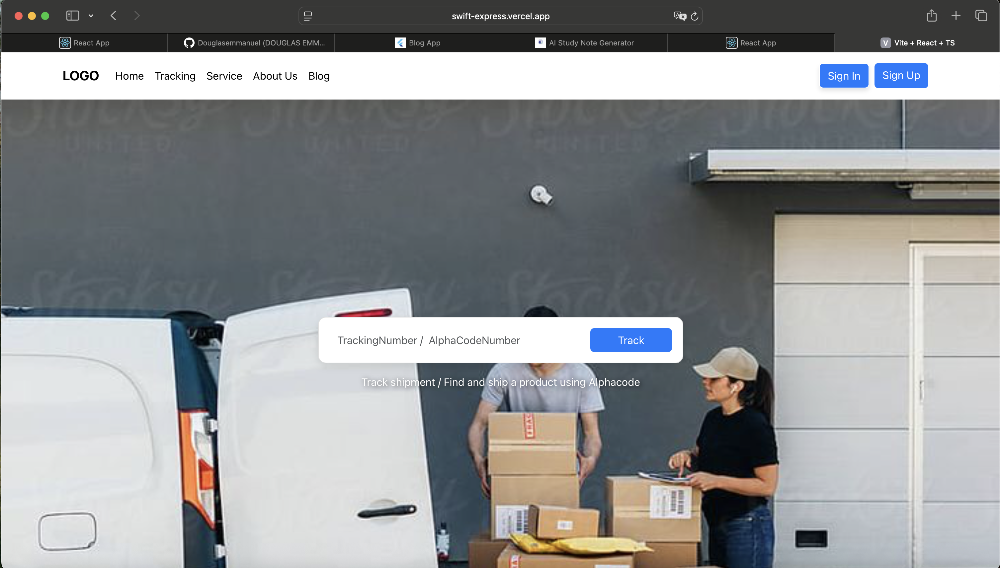
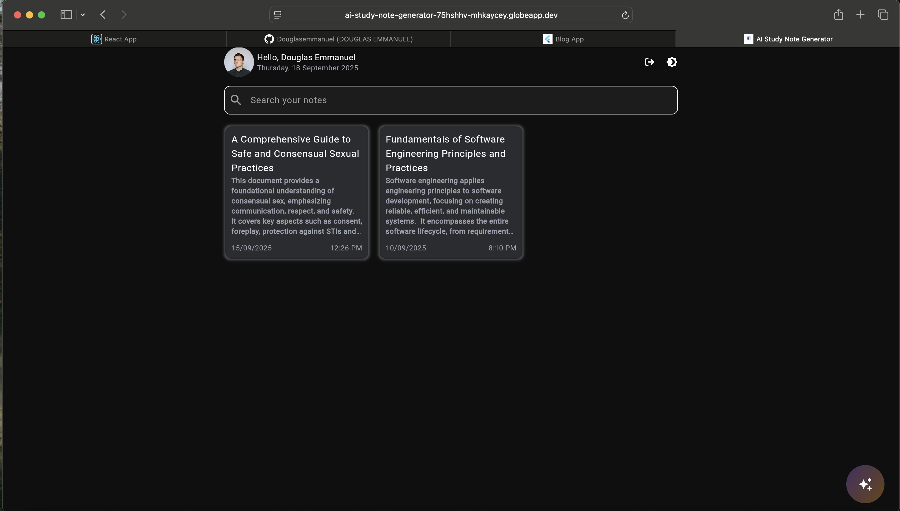
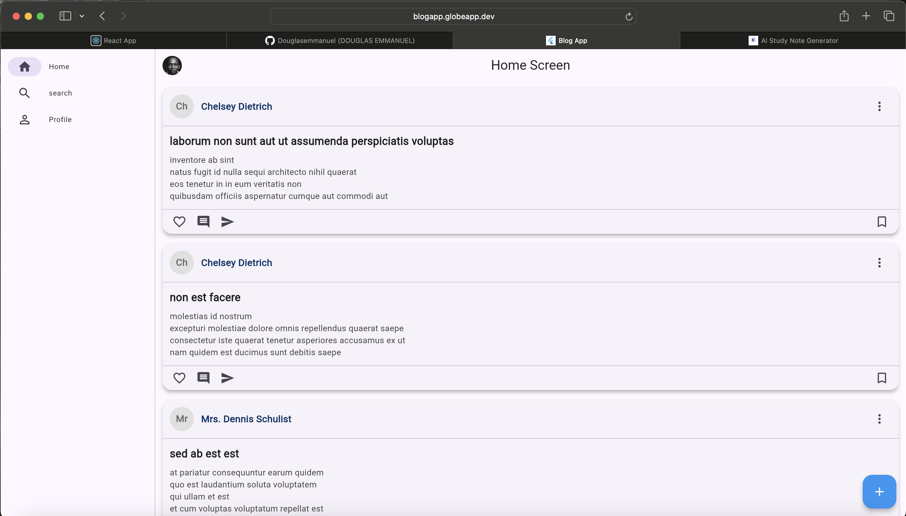
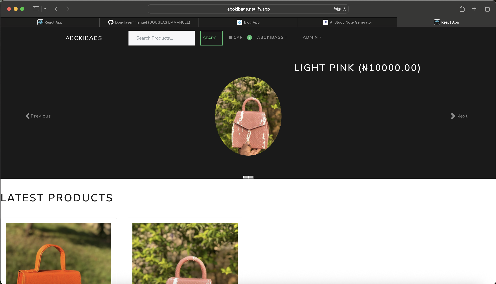
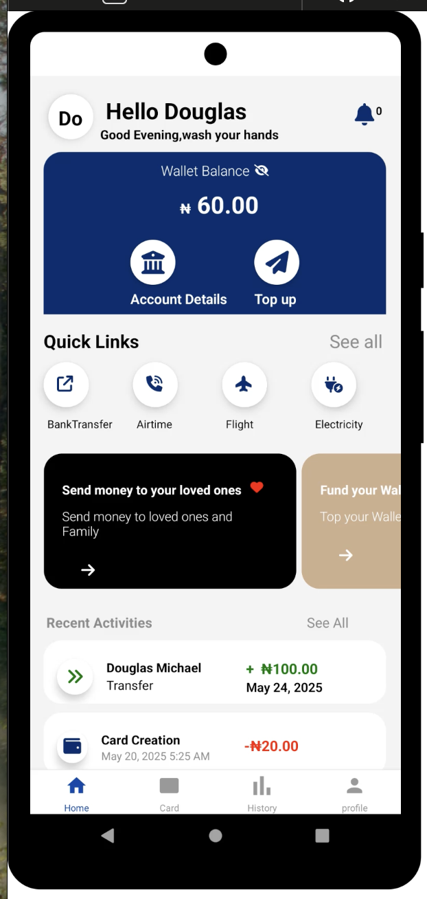

  

<h1 align="center">👋 Hi, I'm Douglas Emmanuel</h1>

  💻 Full-Stack & Cross-Platform Software Engineer  
  
  <strong>React • React Native • Flutter • Django</strong>

---

### 🛠 Tech Stack

| Tech | Icons |
|------|-------|
| **Languages** |     |
| **Frontend** |     |
| **Backend** |   |
| **Databases** |    |
| **Tools** |     |

---

### 🚀 Featured Projects

#### 🌐 Logistics WebApp  
*Logistics webapp built using React, React Native, and Django Rest Framework*  

  

🔗 [View Project](http://swift-express.vercel.app/)

---

#### 📱 AI Study Generator  
*Cross-platform mobile app with Flutter, Firebase and Gemini Generative AI*  

  

🔗 [View Project](https://ai-study-note-generator-75hshhv-mhkaycey.globeapp.dev)

---

#### 📱 Blog App  
*Cross-platform mobile blog app built with Flutter & JSON-Placeholder*  

  

🔗 [View Project](https://blogapp.globeapp.dev/)

---

#### 🛒 E-commerce API  
*Django RESTful API for an e-commerce platform*  

  

🔗 [View Project](https://abokibags.netlify.app)

---

#### 💳 Fintech App  
*React Native Fintech app with Django Rest Framework*  

  

🔗 [View Project](https://appetize.io/app/b_spdhhrb5n4r3oax5ofldgi5wea)

---

### 📈 GitHub Stats

  

---

### 📫 Let’s Connect

- 🌐 Portfolio: [douglas-portfoilo.vercel.app](https://douglas-portfoilo.vercel.app)
- 💼 LinkedIn: [connect](https://www.linkedin.com/in/douglas-emmanuel-554452203)
- 🐦 Twitter/X: [connect](https://x.com/_douglasemma21)
- 📧 Email: emmanueldouglas2121@gmail.com

---

